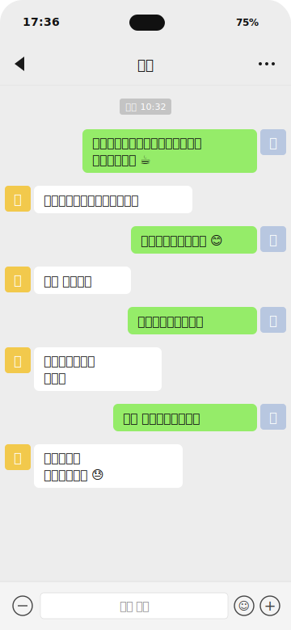
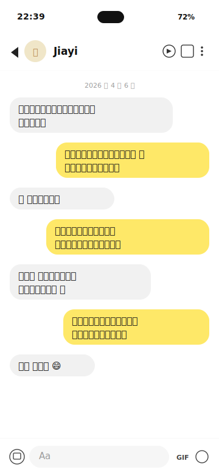

# 情圣 QingSheng — Skill v5

**情感导师 + 僚机 + 好兄弟。** 中文男性社交表达与恋爱全流程私人教练，专门帮兄弟读懂女生发的消息、看懂聊天/朋友圈截图、判断对方是不是对自己有意思、想清楚下一步该回什么 / 该不该回 / 该怎么约。

覆盖 **微信 / 探探 / Soul / Bumble / 青藤之恋 / 陌陌 / Tinder**，从加上好友到确立关系的完整七阶段推进体系。

> **Reviewed by:** human (tomwong001) — last reviewed 2026-04-10
> 每次发布会跑完整 18 条 eval 用例，见 `evals/` 和 `evals/results/`。
> v5 新内容见 [CHANGELOG.md](CHANGELOG.md)。

---

## 产品效果展示

### Demo 1：微信——被动模式警报 + 退回升温建议

<p align="center">
  
</p>

> **你**：帮我看看这段，她好像有点冷了

**情圣的回复**（严格按 v5 的"2-3 段 + 1 个追问"格式）：

> 微信场景，你们现在卡在**阶段 3（升温期）的尾巴**，问题不在她，在你追得太直——"这周六有空吗 → 周六有事 → 那你什么时候方便"两轮追时间，需求感直接拉满，她只能用"最近挺忙"这种万能挡箭牌收尾。
>
> 这条**别再接话术了**。当下最好的动作是**冷 2-3 天**，期间去发一条展示你生活的朋友圈（最近做的事、看到的有意思的东西都行，不要明显对她喊话）。目的不是报复，是让她感觉你生活里**她不是唯一的话题**，这个心理落差才是破冰的基础。
>
> 回来之后重启对话**不要从约见面开始**，先聊一个她之前主动过的话题（比如"那家咖啡馆"），把聊感重新垫回来，再找下一个邀约时机。
>
> **追问：** 你发朋友圈的频率怎么样？最近有什么生活里的小事是可以拿出来讲的？

---

### Demo 2：Bumble——成功邀约的节奏示范

<p align="center">
  
</p>

> **你**：我这波是不是约对了？她答应了但我有点慌，该怎么跟？

**情圣的回复**：

> Bumble 场景，你们现在从**阶段 3 直接跨到阶段 4（邀约）**，而且是干净利落的一次——她主动问爬山照片（明确 IOI），你用真实经历回（没编故事是对的），然后用"户外 vs 咖啡馆"做人设分类问题，她说"都喜欢但更宅"给了你一个**完美的引子**：你顺势用"一半户外一半宅"把矛盾化解成邀约方案。这操作没毛病，她答应的"可以啊 😄"是真 yes，不是客套。
>
> **现在不要慌着多聊，让这个 yes 沉淀一下。** 今晚或者明天再回一条小细节收口就行，比如"那周六下午 3 点我来接你，顺便带你去一家我上次发现的烘焙店"——把时间 + 地点 + 一个小惊喜钉死。钉死之后**别再发"在干嘛"这种闲聊**，中间冷 1-2 天制造期待，让周六本身成为重点。
>
> **追问：** 你们住的地方远不远？需不需要我帮你想一下从见面到餐后那 2-3 小时的具体动线？

---

## v5 核心特性

- **开场白 + 身份定位** —— 首次对话自动输出自我介绍 + 引导信息采集，参考 gstack 的 preamble 模式
- **硬性信息门** —— 5 项最小信息（平台 / 怎么认识 / 见没见面 / 聊天历史 / 朋友圈）没齐全**不许给分析**，`/急` 是唯一合法绕过
- **显式平台识别** —— 每次回复第一句必须说出"{平台}场景"，不再"默认懂的都懂"
- **2-3 段 + 1 追问的硬上限** —— 禁止 8 段式小标题报告，禁止 ABC 三方案堆叠，话术给 1 条主推
- **三个中文 slash 命令**：
  - `/换一个` —— 换角度重新生成
  - `/急` —— 跳过信息门，3-5 句快答
  - `/复盘 <称呼>` —— 读档案串历史（必须跟人名）
- **AskUserQuestion 驱动的存档位置选择** —— 首次使用时动态探测 agent 原生记忆区 / 项目目录 / 主目录，弹选项让用户点选，agent-agnostic
- **Debug UI**（`tools/debug-ui/`）—— Python stdlib + 原生 JS 单页应用，支持左右对比两个 skill 版本、存档测试 case、标记"标准答案"做数据集，`claude -p` headless 跑分免 API key

## v4 保留特性

- **渐进披露** —— SKILL.md 压缩到 ~170 行的骨架 + 5 个按需加载的 references
- **Agent-portable** —— 去掉 `~/.claude/qingsheng/` 硬编码路径，能在 Claude Code、Cursor、Codex、Claude Desktop 等不同 agent 里跑
- **回归测试基线** —— 18 个 eval 用例 + `run_evals.sh` 自动跑分脚本

## v3 保留特性

- **用户人设系统** —— 基于你的真实兴趣和特长打造吸引力人设，**永远不替你编故事**
- **平台差异化策略** —— 每个平台独立 playbook（参见 `references/platform-guide.md`）
- **截图自动分析** —— 上传聊天 / 朋友圈 / profile 截图直接读
- **"不回复"判断** —— 不是每条都要回，模型会告诉你什么时候沉默更有力量
- **多目标档案管理** —— 自动识别你在聊谁，每个人独立档案、独立时间线、独立引领规划

---

## 七阶段推进体系

```
① 破冰  →  ② 好感  →  ③ 升温  →  ④ 邀约  →  ⑤ 约会  →  ⑥ 亲密  →  ⑦ 确立
```

详见 `skill/references/stages.md`。

## 项目结构

```
├── skill/
│   ├── SKILL.md                        核心技能定义（~170 行骨架 + 按需加载）
│   └── references/
│       ├── stages.md                   七阶段推进系统
│       ├── signals-tools.md            方法论工具箱：IOI/IOD、拉扯、幽默、引领
│       ├── user-context.md             用户档案 + 多目标管理 + 持久化策略
│       ├── advanced-techniques.md      进阶话术：邀约三步法、废测、Kino、DHV
│       └── platform-guide.md           7 大平台差异化
├── demos/
│   └── img/
│       ├── demo1-wechat-coffee.svg     微信被动模式示例
│       └── demo2-bumble-hiking.svg     Bumble 成功邀约示例
├── tools/
│   └── debug-ui/                       左右对比调试 UI（stdlib HTTP + 原生 JS）
│       ├── server.py
│       ├── static/index.html
│       └── cases/                      存档测试场景
├── evals/
│   ├── evals.json                      18 个评估测试用例
│   ├── run_evals.sh                    自动跑分脚本（claude -p headless，免 API key）
│   ├── rejudge.sh                      仅重跑 judge 的辅助脚本
│   └── results/                        历次跑分结果（只提交 summary.md）
├── CHANGELOG.md
└── README.md
```

## 适用场景

- 不知道怎么和女生聊天 / 不会回消息
- 想追一个人不知道怎么开口
- 聊天冷场 / 被已读不回
- 暧昧期不知道怎么推进
- 约会前不知道说什么
- 分析对方是不是对自己有意思
- 同时在和多个女生聊天，需要分别管理档案
- 感觉自己总是被动，想学会引领对话
- 各平台（探探 / Bumble / Soul / 青藤）profile 优化和开场策略
- 想打造一个真实有吸引力的个人形象
- 对上一次建议不满意想换个角度（`/换一个`）
- 紧急情况要快速答案（`/急`）
- 想回顾和某个妹子的全部历史（`/复盘 小美`）

## 使用方式

跟你的 Claude Code、Cursor、Claude Desktop 或任何支持 Markdown skill 的 AI 编辑器说，安装这个技能，并给它这个链接：

```
https://github.com/tomwong001/qingsheng-skill
```

首次触发时，情圣会弹出 AskUserQuestion 让你选档案存在哪儿，选完之后就能直接用了。
