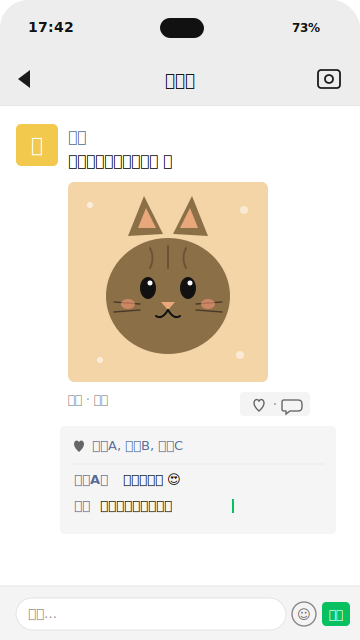

<div align="center">

# 情圣.skill

> *"在吗起手，必是小丑。"*

[](LICENSE)
[](https://claude.ai/code)
[](https://cursor.sh)
[](https://agentskills.io)
[](#支持的平台)

<br>

她发了一条消息，你盯着屏幕看了半小时不知道怎么回？<br>
聊得好好的突然被已读不回，不知道是自己说错了还是她在忙？<br>
朋友圈点赞怕太随便，评论又怕太刻意？<br>
约她被"下次吧"挡了一下，不知道是真下次还是永远不会有？<br>
暧昧期三个月了推不动，表白怕死得太惨，不表白又怕拖没了？<br>
脑子里一堆话想跟她说，打出来又全删了，最后发了个"在吗"？<br>

<br>

**把你最慌的那一刻，交给一个站在你这边的军师。**

不是 PUA 教学 · 不是 ChatGPT 套壳 · 不教你装高价值<br>
用实证心理学打底，教你把真实的自己表达出来

[效果示例](#效果示例) · [方法论](#方法论与理论依据) · [安装](#安装) · [使用](#使用) · [适用场景](#适用场景)

</div>

---

## 效果示例

### 场景一：微信——被动模式警报

<p align="center">
  
</p>

```
你        ❯ 帮我看看这段，她好像有点冷了

情圣      ❯ 微信场景，你们现在卡在阶段 3 的尾巴——问题不在她，在你追得太直。
            "周六有空吗 → 周六有事 → 那你什么时候方便" 两轮追时间，需求感
            直接拉满，她只能用"最近挺忙"这种万能挡箭牌收尾。

            这条别再接话术了。冷 2-3 天，期间去发一条展示你生活的朋友圈
            （真实的事，别为发而发）。目的不是报复，是让她感觉你生活里
            她不是唯一的话题——这个心理落差才是破冰的基础。

            追问：你发朋友圈的频率怎么样？最近有什么生活里的小事可以拿出来讲的？
```

### 场景二：Bumble——成功邀约的收口

<p align="center">
  
</p>

```
你        ❯ 我这波是不是约对了？她答应了但我有点慌，该怎么跟？

情圣      ❯ Bumble 场景，你们从阶段 3 直接跨到阶段 4（邀约），干净利落的
            一次。她主动问爬山照片（明确 IOI），你用真实经历回，然后用
            "户外 vs 咖啡馆"做人设分类问题——她说"都喜欢但更宅"给了你
            一个完美的引子。她答应的"可以啊 😄"是真 yes，不是客套。

            现在不要慌着多聊，让这个 yes 沉淀一下。今晚或明天再回一条
            细节收口："那周六下午 3 点我来接你，顺便带你去一家我上次
            发现的烘焙店"——时间 + 地点 + 一个小惊喜钉死。钉死之后别再
            发"在干嘛"这种闲聊，中间冷 1-2 天制造期待。

            追问：你们住的地方远不远？需要我帮你想一下从见面到餐后那 2-3
            小时的具体动线吗？
```

### 场景三：朋友圈评论——点名 + 具体观察

<p align="center">
  
</p>

```
你        ❯ 她发了张猫的朋友圈，我该怎么评论

情圣      ❯ 猫是什么品种？叫什么名字？她朋友圈一般发得多不多？
            （等你回）好——评论就写"布偶的眼神太有戏了"或"布偶这表情
            是在嫌弃你吧 😂"——点名 + 具体观察，不要写"好可爱"。
            "好可爱"是所有人都会写的，点名说明你真的看了。

            评论完别点赞。点赞是给路人的，评论是给她的——两个都做等于
            稀释了评论的力度。别立刻回她其他聊天窗口，让她在朋友圈那里
            自己看到你。

            追问：她朋友圈发猫的频率高吗？如果高，说明这是她的"软肋话题"，
            你可以顺着这条线慢慢打开一个只属于你们俩的聊天频道。
```

---

## 方法论与理论依据

情圣**不是 ChatGPT 套个中文 prompt**。它从社会心理学、行为科学、依恋理论和现代关系研究里挑出**真正有实证支持**的概念做综合——不是在民间总结的"套路手册"上加个 AI 包装。

### 📊 兴趣信号与投入比判读（IOI / IOD）

怎么判断她是不是对你有意思、你是不是追得太紧？底层是 **Robert Trivers 的亲代投资理论**（evolutionary psychology 里判断关系动态的经典框架）+ **John Gottman 四十年的婚姻互动研究**。核心原则：**谁承担更多主动和风险，谁就在结构上处于更被动的位置**。情圣会逐条分析双方的信号密度和投入比，告诉你现在站在哪一边。

### 🎲 间歇性强化与节奏感

"追得越紧她越冷"不是玄学——**B.F. Skinner 的变强化实验**（variable reinforcement schedule）已经把它解释得很清楚：可预测的持续关注会降低对方对你的心理价值，反而是**不规律、带空间**的回应更让人上瘾。情圣会在合适节点直接告诉你 *"这条别回，冷两天"*——**这不是教你玩手段，是让节奏自然呼吸**。

### 🧠 依恋理论与"废物测试"识别

为什么有些女生会反复用挑衅、冷嘲热讽、突然疏远的方式测试你？不是她"作"，是 **Mary Ainsworth 的依恋风格研究**（Attachment Theory）里焦虑型依恋在寻找安全感的典型表现。情圣识别这种测试时，会教你用**稳定感**回应，而不是被挑衅带着走。

### 🎯 框架控制与主动引领

来自 **Robert Cialdini《影响力》**的一致性原则（commitment & consistency）和社会心理学中的"情境定义权"研究。核心：**谁定义了这段互动的意义和方向，谁就掌握了主动权**。情圣不允许你变成"应答机器"——发现你陷入纯被动时会直接点醒你，教你拿回对话的引领权。

### 💎 真实性原则（这是最硬的一条铁律）

吸引力来自**真实的自我展示**，不是人设表演——这是现代社会心理学里"**自我一致性**"（self-congruence）研究的核心发现，也是 **Carl Rogers 人本主义心理学**的基石。所以情圣**永远不会替你编经历**：所有话术里涉及你兴趣、特长、过往的部分，都必须基于你档案里真实填写的信息。档案里没有的，它会先问你——**绝不瞎编**。

> **这是情圣和市面上那些教你"装高价值"的 PUA 教程最本质的区别。**

### 🪜 七阶段关系推进模型

情圣自己总结的框架，根植于 **John Gottman 的关系发展阶段研究** + 现代约会心理学的实证研究。从破冰到确立关系划分 7 个阶段，每个阶段有明确的**判断标准、典型信号、推进条件**——这样你不会在阶段 3（暧昧期）就急着谈确立（常见的扑街姿势），也不会在阶段 5（约会期）还在用阶段 2 的话术。

```
① 破冰  →  ② 好感  →  ③ 升温  →  ④ 邀约  →  ⑤ 约会  →  ⑥ 亲密  →  ⑦ 确立
```

---

## 怎么做出来的

- **真实用户驱动迭代** —— 每次版本改动都是从实际使用里的痛点反推，不闭门造车
- **私有语料蒸馏** —— 从大量私有恋爱/社交课程语料中提取了 5000+ 概念和 1400+ 真实对话样本，经过去重、质量筛选后精选融入 skill，不是靠通用模型的"常识"在回答
- **22 条回归测试套件** —— 每个版本发布前跑一遍 eval 拿客观分数，历次基线存在 `evals/results/`，每次迭代的好坏都有账可查
- **三道审美关卡** —— 每条建议都要过"**不油腻、不套路、兄弟聊天感**"三个人肉过滤。任何像 PUA 教学腔或 AI 客服话术的输出都会被重写
- **模块化 Markdown skill** —— 10 个按需加载的参考文件，区分 7 个关系阶段、7 个主流平台、多目标档案并行、主动引领机制。不是一坨 prompt 塞给模型
- **全流程透明** —— 所有逻辑都在 `skill/SKILL.md` + `skill/references/*.md` 里，你可以打开看情圣"脑子里在想什么"。没有黑盒，没有隐藏 system prompt

---

## 支持的平台

| 平台 | 状态 | 核心场景 |
|------|:---:|------|
| 💬 **微信** | ✅ | 长期关系维护 · 朋友圈互动 · 暧昧期推进 |
| 🔥 **探探** | ✅ | Match 后破冰 · 快速邀约 · Profile 优化 |
| 💫 **Soul** | ✅ | 兴趣匹配 · 慢热型聊天 · 灵魂伴侣人设 |
| 🐝 **Bumble** | ✅ | 女生先开口机制 · 国际化语境 |
| 🌿 **青藤之恋** | ✅ | 高学历 / 背景匹配 · 严肃交往风格 |
| 🌙 **陌陌** | ✅ | 同城 · 快速线下 |
| 🔥 **Tinder** | ✅ | 国际化 · 英文话术切换 |

每个平台独立 playbook，参见 [`skill/references/platform-guide.md`](skill/references/platform-guide.md)。

---

## 安装

> **免依赖**：情圣是纯 Markdown skill。**不需要 Python、不需要 API key、不需要启动服务**，clone 下来就能用。

### Claude Code

```bash
# 装到当前项目
mkdir -p .claude/skills
git clone https://github.com/tomwong001/qingsheng-skill .claude/skills/qingsheng

# 或装到全局（所有项目都能用）
git clone https://github.com/tomwong001/qingsheng-skill ~/.claude/skills/qingsheng
```

### Cursor / Codex / Claude Desktop

把 skill 目录加到你 agent 的 skills 路径即可。具体路径参考各 agent 官方文档。情圣是 **agent-agnostic** 设计，不假设任何特定 agent 的存储约定。

---

## 使用

### 第一次使用

在 Claude Code / Cursor / 任何支持 skill 的 agent 里直接说一句：

```
帮我看看这段聊天
```

或者：

```
她这话什么意思
```

情圣会自动触发，弹出自我介绍 + 引导你提供最少信息（平台 / 怎么认识 / 聊天记录）。首次使用时会用 `AskUserQuestion` 让你**亲手点选**档案存在哪里（agent 原生记忆区 / 项目目录 / 主目录 / 自定义）。

### 快捷指令

| 指令 | 干什么 | 适用场景 |
|------|------|------|
| `/换一个` | 换角度重新生成（不是换措辞说同样的话） | 对上一条建议不满意 |
| `/急` | 跳过信息采集，3-5 句直接给答案 | 在外面没时间走全套流程 |
| `/复盘 <称呼>` | 读档案串历史，复盘你和某个妹子的全部进展 | 想回顾战绩 / 纠结要不要继续 |
| `/展示面` | 诊断你的社交平台形象——打分 + 问题 + 改法 | 微信头像丑 / 朋友圈不知道发啥 / 探探没人右滑 |
| `/挽回` | 冷激活（聊天冷了）或关系挽回（分手后），给诊断 + 时间线 + 第一条消息 | 被已读不回 / 突然变冷 / 分手想恢复 |
| `/自动` | Autopilot 模式——AI 生成 3-5 轮对话树，带分支和节奏控制 | 不知道接下来几天怎么聊 / 想要完整的推进规划 |
| `/顾问` | 切回默认顾问模式（分析 + 建议，你自己发消息） | 从 Autopilot 退出 |

### 工作流程

```
你发问 → 第零步信息门（平台/关系/聊天历史够不够？）
       → 第一步一句话定位（显式说出平台 + 当前阶段）
       → 第二步给建议（2-3 段 + 1 个追问，硬上限）
       → 下一轮继续补齐信息，来回迭代
```

**兄弟聊天风格，不写报告。** 一次回复就给最关键的 1-2 点，然后一个具体追问把对话推下去。

---

## 适用场景

- 🥺 她发了条消息，你不知道怎么回
- ❄️ 聊天突然冷场，不知道是你说错了还是她在忙
- 📱 朋友圈想点赞 / 评论但下不了手
- 🍜 约她被 "下次吧" 挡了一下
- ⏰ 暧昧期推不动，表白 / 不表白都焦虑
- 🎯 想判断她到底是不是对你有意思
- 👥 同时在和几个人聊天，需要分别管理档案
- 🚦 感觉自己总是在"应答机器"模式，想拿回主动权
- 🌐 不同平台（探探 / Bumble / Soul / 青藤）的差异化策略
- 🧱 打造真实有吸引力的个人形象（**不是装高价值**）
- 📸 展示面诊断——头像、朋友圈、签名、Bio 全方位打分 + 改法
- 🔄 聊天冷了 / 分手了想挽回，有专门的冷激活和关系恢复流程
- 🤖 不知道接下来几天怎么聊？Autopilot 直接给你对话树，带分支和节奏

---

## 项目结构

```
qingsheng-skill/
├── skill/
│   ├── SKILL.md                        # 核心技能 ~170 行 + 按需加载
│   └── references/
│       ├── stages.md                   #   七阶段推进系统
│       ├── signals-tools.md            #   IOI/IOD · 拉扯 · 引领 · 框架
│       ├── user-context.md             #   用户档案 · 多目标管理 · 持久化
│       ├── advanced-techniques.md      #   邀约三步法 · 废测 · Kino · DHV
│       ├── platform-guide.md           #   7 平台差异化 playbook
│       ├── examples-library.md         #   40 个真实对话样本（按阶段分类）
│       ├── mindset-concepts.md         #   15 个心态/元策略概念
│       ├── profile-audit.md            #   展示面诊断（各平台评分维度）
│       ├── recovery-playbook.md        #   挽回与冷激活手册
│       └── autopilot-guide.md          #   Autopilot 对话树模式
├── demos/img/
│   ├── demo1-wechat-coffee.svg         # 微信被动模式示例
│   ├── demo2-bumble-hiking.svg         # Bumble 成功邀约示例
│   └── demo3-wechat-moments-cat.svg    # 朋友圈评论示例
├── evals/
│   ├── evals.json                      # 22 条回归测试用例
│   ├── run_evals.sh                    # 自动跑分脚本（免 API key）
│   └── results/                        # 历次基线
├── CHANGELOG.md
└── README.md
```

---

## 注意事项

- **原材料质量决定建议质量**：截图 + 背景故事 > 只描述几句话
- **真实性原则是铁律**：情圣永远不会替你编经历。话术里用到你的兴趣、特长、故事都必须基于你档案里真实填写的信息
- **建议不等于命令**：给的都是判断和选项，最终发不发、怎么发由你决定
- **节奏比话术重要**：有时候最好的回复是不回。情圣会直接告诉你"这条别回，冷 X 小时"
- **目前还是 beta**：欢迎 issue + PR

---

## 免责声明

> 情圣是一个**社交表达工具**，不是"追女生的作弊器"。它帮你看清局势、读懂信号、表达真实的自己——但**吸引力的底层永远是你本人怎么样**，不是嘴里说出什么话。
>
> 如果你期待的是"一句话把女神拿下"，任何工具都不会让你满意。如果你希望的是"把自己最好的一面真实且有节奏地呈现出来"，那情圣能帮上你。
>
> **情圣不鼓励操纵、欺骗、骚扰或纠缠任何人。** 对方明确拒绝时，情圣会直接告诉你"这段到此为止"，然后给你一个体面退出的方案——因为这也是一个军师该做的事。

---

<div align="center">

> *"我会陪在你身边，帮你把到你最心仪的妹子。"*
>
> — 情圣

<br>

**MIT License © [@tomwong001](https://github.com/tomwong001)**

<sub>Built with ❤️ and a lot of 兄弟聊天.</sub>

</div>
